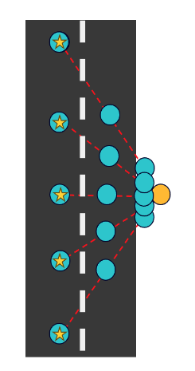

<h1 class="fade-in-text-1">ODDS - Overhead Structure Detection and Data Science</h1>

<a href="https://github.com/jcheung4/DSC180B">GitHub Repository</a> | <a href="https://github.com/jcheung4/DSC180B">Report</a>

by Derek Wen, Sunwoo Kim, Jonathan Cheung, and Kevin Bui

<h2 class="fade-in-text-3">Abstract</h2>

In the face of climate change, the accurate and consistent monitoring of utility poles becomes important for preventing wildfires and ensuring community safety. Traditional methods for maintaining utility pole databases are fraught with challenges, including data incompleteness and the labor-intensive nature of manual updates. Previous approaches have struggled to efficiently update and verify the accuracy of these databases, leaving a significant gap in utility risk management practices. Our project addresses this gap by developing an automated tool that leverages Google Street View images and advanced computer vision techniques to identify and analyze utility poles. By inputting geographical coordinates, our system captures images along specified roads, detecting each pole's unique features such as its material type. This automation significantly reduces human error and labor, offering a scalable solution to improve the accuracy and completeness of utility pole records. Our method introduces a novel approach to utility infrastructure monitoring, promising enhancements in reliability, safety, and responsiveness to environmental risks.

<h2 class="fade-in-text-4">Introduction</h2>

As climate change increases the chances of wildfires over the recent years, utility risk management has become an integral aspect of community safety. Many of the databases keeping track of power line poles are often incomplete, with relevant data missing and requiring significant human effort to update and maintain accurate records. Our project proposes an automated solution that uses the power of Google Street View and advanced computer vision techniques to change the way utility poles are monitored. By automating the detection and analysis of utility poles, our tool aims to significantly enhance the accuracy and efficiency of utility pole databases, thereby contributing to the prevention of wildfires and the enhancement of community safety.

The challenge of maintaining accurate and comprehensive utility pole records is not new. Previous efforts have primarily relied on manual inspections and record-keeping, which are both time-consuming and prone to human error. These approaches also face challenges related to cost, scalability, and the resolution of captured images. Recent advancements in technology have led to the exploration of automated systems for infrastructure monitoring, utilizing image capture technology. Our project builds upon these foundations by leveraging the accessibility of Google Street View imagery, coupled with computer vision techniques, to offer a new and scalable solution for utility pole monitoring.

Our project utilizes a rich dataset derived from Google Street View, offering comprehensive coverage of urban and rural roadways where utility poles are commonly located. This dataset is uniquely suited to address our problem due to its widespread availability and imagery it provides, which is essential for identifying specific features of utility poles. By employing advanced computer vision algorithms, we can automate the detection and classification of utility poles from these images, overcoming the limitations of manual data collection methods. The data's broad geographic scope and the detailed visual information it contains make it an invaluable resource for developing a scalable and efficient tool for utility pole monitoring, with the potential for widespread application across various utility management scenarios.

<h2 class="fade-in-text-5">Methods</h2>

Our project aims to automate the identification and analysis of utility poles using Google Street View images coupled with computer vision techniques. This process involved several key steps: data collection through the Google Street View API, image processing and pole detection using DETR (DEtection TRansformer) object detection models, and data validation against a utility pole database. This section describes the methodology we employed across these stages, ensuring that our approach is replicable and transparent.

Data Collection: We initiated our project by collecting images of utility poles from Google Street View. To achieve this we each created our own python scripts and utilized the Google Street View API. We captured images of different utility poles from different angles and field of views, collecting over eight hundred images in the process. This method ensured comprehensive coverage and diversity in the pole images collected.

Image Processing and Pole Detection: Once the images were collected, we proceeded with the image processing and pole detection phase. We employed DETR object detection models, which were fine-tuned to specifically identify utility poles from the Street View images. The DETR model, known for its efficiency in processing images and detecting objects within them, was adapted to recognize the material quality of the utility poles.

Model Training: We fine-tuned the DETR model using a subset of manually annotated images, which included diverse examples of utility poles. This training process involved adjusting the model's parameters to improve its accuracy in detecting poles from various angles.

Data Validation and Quality Control: The final step in our methodology involved validating the detected poles against an existing utility pole database from SDGE. This process was crucial for assessing the completeness and accuracy of the database and identifying any discrepancies.

Database Extraction: To setup our dummy database, that is a replica of SDG\&E's database, we utilized Docker for initial setup. This allows us to create a docker container uses a PostgreSQL image and can allow us to create, read, update, and delete tables when needed. Based on the initial coordinates that are provided, we can query the dummy database using a distance calculation to get the count of poles between the initial coordinates. For our own database, we can add the coordinates of the pole whenever a model detects it and from there, we can compare the count of poles that we calculated versus the count that was found in the dummy database. 

Comparison and Validation: The information from the detected poles was then compared with the database entries to identify missing poles, inaccuracies in material classification, or any other discrepancies. This comparison allowed us to assess the effectiveness of our detection model and the quality of the existing database records.

    
    
Figure 1: Collecting images from different angles and field of views for the same pole

<h2 class="fade-in-text-6">Results</h2>

Results Here

<h2 class="fade-in-text-7">Discussion</h2>

Discussion Here

<h2 class="fade-in-text-8">Conclusion</h2>

Conclusion Here

