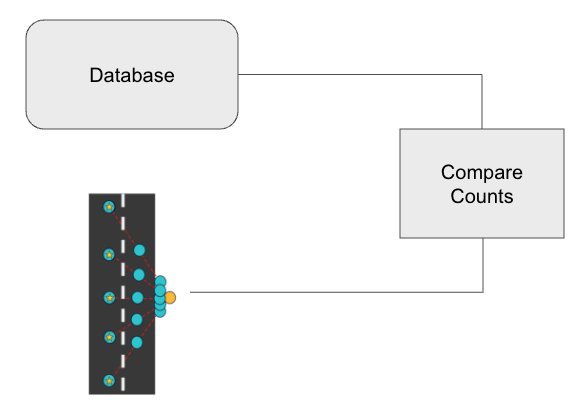

<h1 class="fade-in-text-1">ODDS - Overhead Structure Detection and Data Science</h1>

<a href="https://github.com/jcheung4/DSC180B">GitHub Repository</a> | <a href="https://github.com/jcheung4/DSC180B">Report</a>

by Derek Wen, Sunwoo Kim, Jonathan Cheung, and Kevin Bui

<h2 class="fade-in-text-3">Abstract</h2>

Amid climate change, consistent and accurate utility pole monitoring is crucial for wildfire prevention and community safety. Traditional manual methods for updating utility pole databases are labor-intensive and often inaccurate. Our project overcomes these challenges by introducing an automated tool that uses Google Street View and computer vision to efficiently identify and analyze utility poles, reducing human error and improving database accuracy and completeness. This approach enhances the reliability, safety, and environmental risk responsiveness of utility infrastructure monitoring.

<h2 class="fade-in-text-4">Introduction</h2>

With the growing wildfire risk due to climate change, effective utility risk management is essential for community safety. Existing databases for power line poles are often incomplete and updating them requires substantial manual effort. Our project introduces an automated solution leveraging Google Street View and computer vision to improve utility pole monitoring. This system enhances the accuracy and efficiency of utility pole databases, aiding in wildfire prevention and boosting community safety.

Maintaining precise and exhaustive utility pole records has always been challenging, largely due to the time-intensive and error-prone nature of manual inspections and record-keeping. Traditional methods also grapple with issues of cost, scalability, and image resolution. Leveraging recent technological advancements, our project employs Google Street View imagery and computer vision to provide a scalable and innovative approach to utility pole monitoring, enhancing the efficiency and reliability of infrastructure maintenance.

This project leverages Google Street View's extensive dataset, encompassing a wide array of urban and rural locations where utility poles are found. This dataset's widespread accessibility and detailed imagery are pivotal for identifying utility pole features. Utilizing sophisticated computer vision algorithms, we automate the detection and categorization of utility poles, surpassing traditional manual collection methods in efficiency. This approach not only capitalizes on the dataset's vast geographic coverage and rich visual detail but also holds promise for broad application in utility management, offering a scalable and effective utility pole monitoring solution.

<h2 class="fade-in-text-5">Methods</h2>

Our project aims to automate the identification and analysis of utility poles using Google Street View images coupled with computer vision techniques. This process involved several key steps: data collection through the Google Street View API, image processing and pole detection using DETR (DEtection TRansformer) object detection models, and data validation against a utility pole database. This section describes the methodology we employed across these stages, ensuring that our approach is replicable and transparent.

We utilized Python scripts and the Google Street View API to collect diverse images of utility poles, amassing over eight hundred images to ensure varied coverage.

    
    
Figure 1: Collecting images from different angles and field of views for the same pole

Utilizing the DETR object detection model, we fine-tuned it to identify utility poles and their materials from the images, enhancing its detection capabilities through a training set of annotated images.

    
    
Figure 2: Detecting wooden and metal poles from Google street view images

We compared the detected poles against a mock utility pole database, mirroring SDG&E's system, to verify accuracy and completeness. Using Docker and PostgreSQL, we created a database to validate and update the pole records based on our detection outcomes, ensuring our model's effectiveness in identifying discrepancies and updating records accordingly.

    
    
Figure 3: Comparing counts using our own database to validate and update accordingly

<h2 class="fade-in-text-6">Results</h2>

Results Here

<h2 class="fade-in-text-7">Discussion</h2>

Discussion Here

<h2 class="fade-in-text-8">Conclusion</h2>

Conclusion Here

