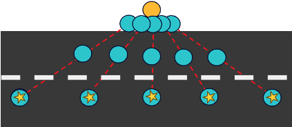
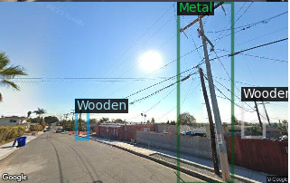
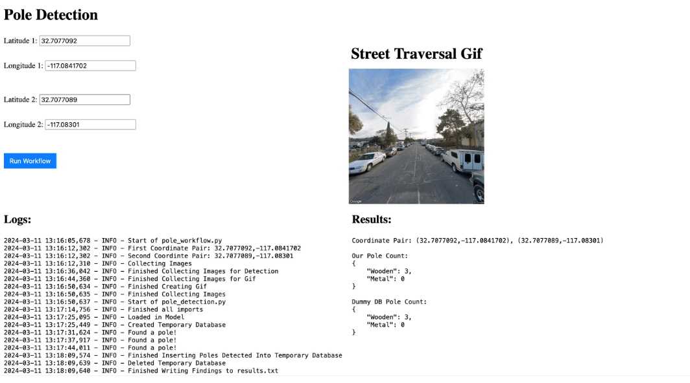
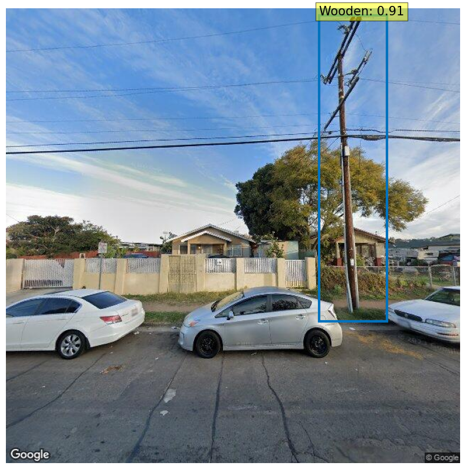
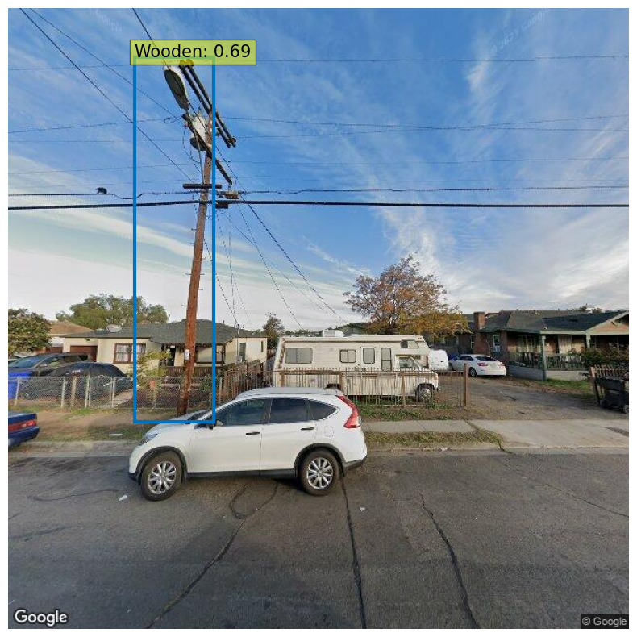

    

        
    

    

        
    

<h1 class="fade-in-text-1">Enhancing Utility Pole Monitoring with Computer Vision</h1>

<a href="https://github.com/jcheung4/DSC180B">GitHub Repository</a> | <a href="https://github.com/jcheung4/DSC180B">Report</a>

Welcome to our project website! Here we share our journey and findings from our HDSI capstone project with help of SDGE, which focuses on improving utility pole monitoring through the innovative use of computer vision and Google Street View images. 

by Derek Wen, Sunwoo Kim, Jonathan Cheung, and Kevin Bui

<h2 class="fade-in-text-3">Our Mission</h2>

In a world where climate change is escalating the risks of wildfires, our project provides a step for monitoring utility poles more effectively, ensuring community safety and enhancing the reliability of utility infrastructure.

Our initiative employs computer vision with Google Street View to automate the monitoring of utility poles, boosting the accuracy and efficiency of current database maintenance practices. Utility pole monitoring has traditionally been a tedious and error-prone process. By harnessing a rich dataset from Google Street View, we've developed an automated system to detect and identify the material quality of utility poles across different locations, streamlining the monitoring process and offering scalable benefits.

<h2 class="fade-in-text-4">Our Methods</h2>

Our methodology encompasses a series of steps designed to automate utility pole detection and classification, ensuring a replicable approach.

<h3 class="fade-in-text-5">Data Collection</h3>

We've created a python script to gather over 800 images from Google Street View, capturing various utility poles from multiple perspectives and field of views.

    
    
Figure 1: Our methodology for collecting images from different angles and field of views for the same pole. The yellow circle indicates the utility pole and the blue circles indicate the different angles the picture is taken at 

<h3 class="fade-in-text-6">Image Processing and Pole Detection</h3>

Employing a DETR (DEtection TRansformer) object detection model, we've fine-tuned our system to identify and classify utility poles from the collected images, demonstrating the practical application of our solution. The model was adapted to recognize the material quality of the utility poles.

    
    
Figure 2: Detecting wooden and metal poles from a Google Street View image

<h3 class="fade-in-text-7">Data Validation</h3>

Our validation process compares our detected poles against a simulated database, ideally a database from a utility company, ensuring the accuracy and reliability of our system. In our case, we used a sample database from SDGE to compare our counts from our database.

    
    
Figure 3: Comparing and validating detected utility poles of our database against database records from SDGE

<h2 class="fade-in-text-8">Results</h2>

We have created a demo that navigates through a predefined street segment using starting and ending coordinates. As the script progresses along the street, it employs our model to identify and classify any wooden or metal utility poles encountered, showcasing the model's real-world utility and effectiveness. The counts is kept track onto our database and is compared againast a simulated database (SDGE in this case).

    
    
Figure 4: Demo of our model that traverses down a street given its coordinates and returns a street traversal GIF and the utility pole counts

    

        
    

    

        
    

Our project's findings indicate a promising step forward in automated utility pole monitoring. By leveraging computer vision with Google Street View images, we were able to identify and classify various utility poles, demonstrating consistency with SDG&E's actual database. Our method shows that automated detection can closely mirror, and potentially enhance, existing utility pole data, leading to more accurate and efficient monitoring systems.

<h2 class="fade-in-text-8">Discussion</h2>

The positive results from our automated system highlight its potential to improve upon traditional utility pole monitoring methods. Compared to prior work, our approach utilizes more recent and advanced computer vision techniques, resulting in an innovative and effective solution. While our findings align with the broader goals of enhanced infrastructure monitoring, they also underscore the limitations inherent in using static image sources like Google Street View, which may not always reflect real-time conditions.

Furthermore, our project opens the door to numerous possibilities for future enhancements. Future iterations could integrate more dynamic and real-time data sources, employ more advanced machine learning models for increased accuracy, and explore the potential for broader infrastructure applications beyond utility poles.

<h2 class="fade-in-text-8">Conclusion</h2>

This project demonstrates the significant potential of integrating computer vision with accessible image sources like Google Street View to enhance utility pole monitoring. Our findings offer a glimpse into a future where such technologies can play a pivotal role in improving infrastructure management, thereby contributing to wildfire prevention and community safety. As we look to the future, we are excited about the possibilities of expanding this technology to tackle broader challenges and achieve greater impact in the realm of infrastructure monitoring and beyond.

Thank you for taking a look at our project!

